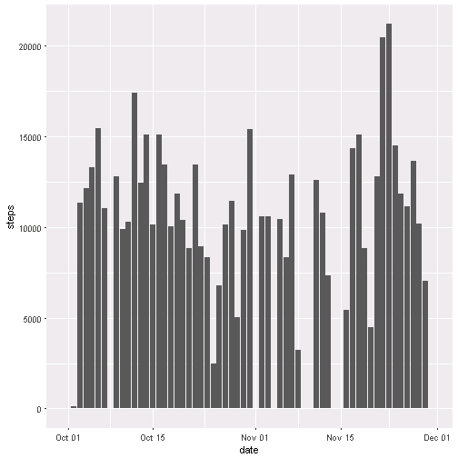
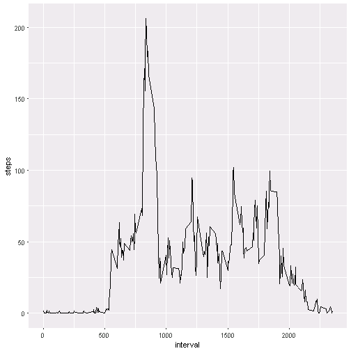
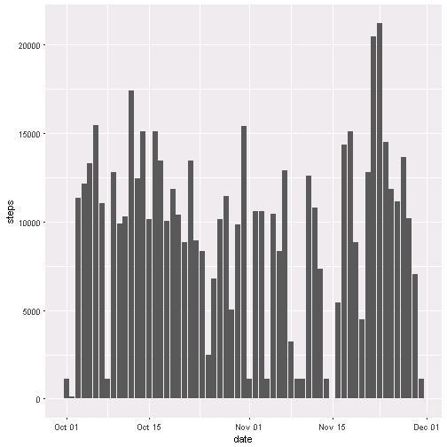
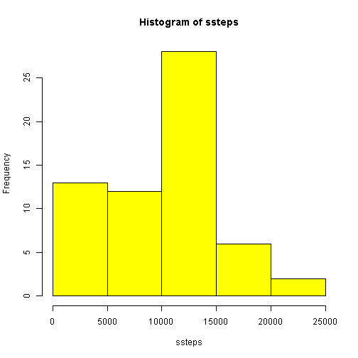
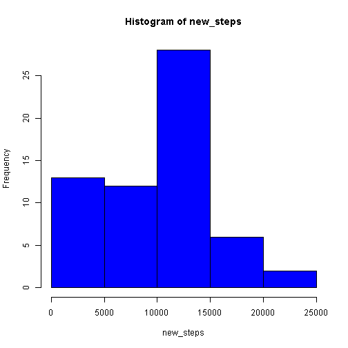
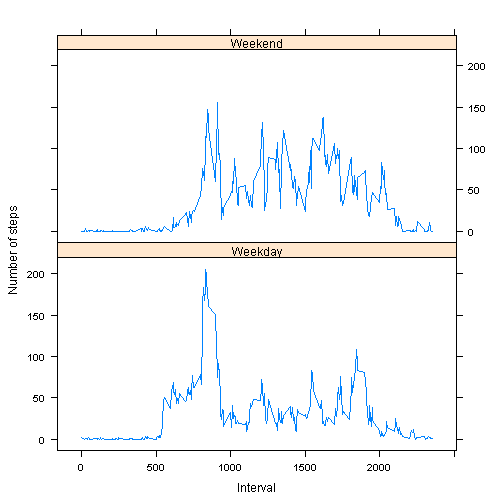

---
title: "Assignment"
output: html_document
---


## R Markdown

This is an R Markdown document. Markdown is a simple formatting syntax for authoring HTML, PDF, and MS Word documents. For more details on using R Markdown see <http://rmarkdown.rstudio.com>.

When you click the **Knit** button a document will be generated that includes both content as well as the output of any embedded R code chunks within the document. You can embed an R code chunk like this:


```r
MyData <- read.csv(file="C:/Users/kumad22/Downloads/Coursera_M2W2/activity.csv", header=TRUE, sep=",")
```

```
## Warning in file(file, "rt"): cannot open file 'C:/Users/kumad22/Downloads/
## Coursera_M2W2/activity.csv': No such file or directory
```

```
## Error in file(file, "rt"): cannot open the connection
```

```r
summary(MyData)
```

```
##      steps                date          interval     
##  Min.   :  0.00   2012-10-01:  288   Min.   :   0.0  
##  1st Qu.:  0.00   2012-10-02:  288   1st Qu.: 588.8  
##  Median :  0.00   2012-10-03:  288   Median :1177.5  
##  Mean   : 37.38   2012-10-04:  288   Mean   :1177.5  
##  3rd Qu.: 12.00   2012-10-05:  288   3rd Qu.:1766.2  
##  Max.   :806.00   2012-10-06:  288   Max.   :2355.0  
##  NA's   :2304     (Other)   :15840
```

```r
ssteps<-tapply(MyData$steps,MyData$date,sum,na.rm=TRUE)
## Mean and median number of steps taken per day
mean(ssteps)
```

```
## [1] 9354.23
```

```r
median(ssteps)
```

```
## [1] 10395
```

```r
library(dplyr)
```

## Calculate the total number of steps taken per day & Histogram of the total number of steps taken each day.

```r
   new<-aggregate.data.frame(MyData$steps, by=list(date=MyData$date),FUN=sum,na.rm=TRUE)
   colnames(new)[2] <- "steps"
   head(new)
```

```
##         date steps
## 1 2012-10-01     0
## 2 2012-10-02   126
## 3 2012-10-03 11352
## 4 2012-10-04 12116
## 5 2012-10-05 13294
## 6 2012-10-06 15420
```

```r
   library(ggplot2)
   library(lubridate)
   new$date <- ymd(new$date)
   ggplot(data=new,aes(date,steps),xName='date',xShowTitle=TRUE,yShowTitle=TRUE,xShowTickLabel=FALSE,yShowTickLabel=FALSE)+geom_histogram(stat="identity")
```

```
## Warning: Ignoring unknown parameters: binwidth, bins, pad
```


  
## Time series plot of the average number of steps taken.

```r
   new<-aggregate.data.frame(MyData$steps, by=list(interval=MyData$interval),FUN=mean,na.rm=TRUE)
   colnames(new)[2] <- "steps"
   head(new)
```

```
##   interval     steps
## 1        0 1.7169811
## 2        5 0.3396226
## 3       10 0.1320755
## 4       15 0.1509434
## 5       20 0.0754717
## 6       25 2.0943396
```

```r
   ggplot(new, aes(interval, steps),xName='date',xShowTitle=TRUE,yShowTitle=TRUE,xShowTickLabel=FALSE,yShowTickLabel=FALSE) + geom_line(stat="identity")
```


## The 5-minute interval that, on average, contains the maximum number of steps

```r
   z<-new[which(new$steps==max(new$steps)),]
   z$interval
```

```
## [1] 835
```

## Code to describe and show a strategy for imputing missing data 
#### In the data set provided,a lot of cells specially under the column steps are missing(their values are NA).

```r
   act <- read.csv(file="C:/Users/kumad22/Downloads/Coursera_M2W2/activity.csv",header=TRUE, sep=",",colClasses = c("numeric", "character","integer"))
```

```
## Warning in file(file, "rt"): cannot open file 'C:/Users/kumad22/Downloads/
## Coursera_M2W2/activity.csv': No such file or directory
```

```
## Error in file(file, "rt"): cannot open the connection
```

```r
   a<-sum(is.na(MyData))
   a
```

```
## [1] 2304
```

```r
   library(dplyr)
   data<-act %>% 
   group_by(interval) %>%
   mutate(steps = ifelse(is.na(steps), median(steps, na.rm=TRUE), steps))
   summary(data)
```

```
##      steps         date              interval     
##  Min.   :  0   Length:17568       Min.   :   0.0  
##  1st Qu.:  0   Class :character   1st Qu.: 588.8  
##  Median :  0   Mode  :character   Median :1177.5  
##  Mean   : 33                      Mean   :1177.5  
##  3rd Qu.:  8                      3rd Qu.:1766.2  
##  Max.   :806                      Max.   :2355.0
```

## Make a histogram of total number of steps taken each day

```r
  data$date <- ymd(data$date)
  ggplot(data=data,aes(date,steps),   xName='date',xShowTitle=TRUE,yShowTitle=TRUE,xShowTickLabel=FALSE,yShowTickLabel=FALSE)+geom_histogram(stat="identity")
```

```
## Warning: Ignoring unknown parameters: binwidth, bins, pad
```



###Mean and median for the new data

```r
new_steps<-tapply(data$steps,data$date,sum,na.rm=TRUE)
mean(new_steps)
```

```
## [1] 9503.869
```

```r
median(new_steps)
```

```
## [1] 10395
```

#### Check if the mean and median of the new data is different form that of the previous one.

```r
  mean(ssteps)==mean(new_steps)
```

```
## [1] FALSE
```

```r
  median(ssteps)==median(new_steps)
```

```
## [1] TRUE
```

```r
#### What is the impact of imputing missing data on the estimates of the total daily number of steps?Min values increases by 41 units and mean increases by 149.6 units.
  summary(ssteps)
```

```
##    Min. 1st Qu.  Median    Mean 3rd Qu.    Max. 
##       0    6778   10395    9354   12811   21194
```

```r
  summary(new_steps)
```

```
##    Min. 1st Qu.  Median    Mean 3rd Qu.    Max. 
##      41    6778   10395    9504   12811   21194
```

```r
  summary(new_steps) - summary(ssteps)
```

```
##    Min. 1st Qu.  Median    Mean 3rd Qu.    Max. 
##    41.0     0.0     0.0   149.6     0.0     0.0
```

```r
  hist(ssteps,col="yellow")
```



```r
  hist(new_steps,col="blue")
```


  
  
  ```r
  library(chron)
  library(lattice)
  #actdata <- read.csv(file="C:/Users/kumad22/Downloads/Coursera_M2W2/activity.csv")
  data$date <- as.Date(data$date, "%Y-%m-%d")
  days <- weekdays(data$date)
  data$day_type <- ifelse(days == "Saturday" | days == "Sunday", "Weekend", "Weekday")
  meansteps <- aggregate(data$steps, by = list(data$interval, data$day_type), mean)
  head(meansteps)
  ```
  
  ```
  ##   Group.1 Group.2          x
  ## 1       0 Weekday 2.02222222
  ## 2       5 Weekday 0.40000000
  ## 3      10 Weekday 0.15555556
  ## 4      15 Weekday 0.17777778
  ## 5      20 Weekday 0.08888889
  ## 6      25 Weekday 1.31111111
  ```
  
  
  ```r
  colnames(meansteps) <- c("interval", "day", "steps")
  head(meansteps)
  ```
  
  ```
  ##   interval     day      steps
  ## 1        0 Weekday 2.02222222
  ## 2        5 Weekday 0.40000000
  ## 3       10 Weekday 0.15555556
  ## 4       15 Weekday 0.17777778
  ## 5       20 Weekday 0.08888889
  ## 6       25 Weekday 1.31111111
  ```

```r
xyplot(steps ~ interval | day, meansteps, type = "l", layout = c(1, 2), xlab = "Interval", ylab = "Number of steps")
```



```r
Sys.sleep(30)
```

